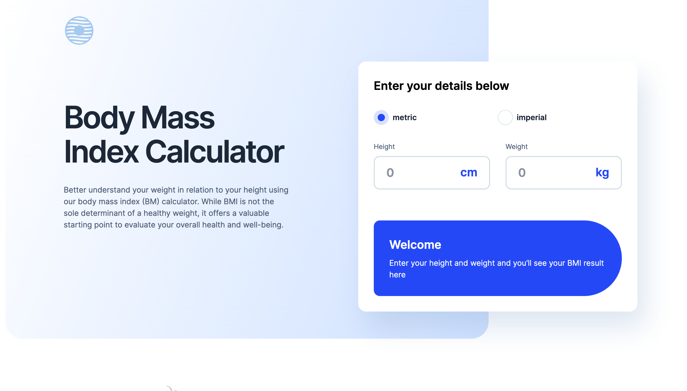

# Body Mass Index Calculator

## Welcome! 👋

Welcome to the Body Mass Index (BMI) Calculator project, built with React.js and styled using Tailwind CSS.

## Project Overview

Your challenge is to recreate a BMI calculator page based on the provided design. The project requirements include:

- Allowing users to select between metric or imperial units.
- Providing input fields for height and weight.
- Displaying the BMI result.
- Ensuring responsive design for various screen sizes.
- Implementing hover and focus states for interactive elements.

### Technologies Used

- React.js
- Tailwind CSS
